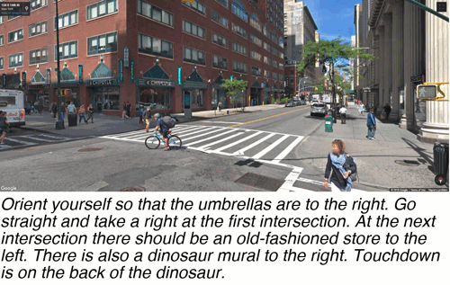

# The Touchdown Dataset

Touchdown is a corpus for executing navigation instructions and resolving spatial descriptions in visual real-world environments. The task is to follow instruction to a goal position and there find a hidden object, Touchdown the bear. 

<p align="center">  
  
</p>


The details of the corpus and task are described in: **Touchdown: Natural Language Navigation and Spatial Reasoning in Visual Street Environments**. Howard Chen, Alane Suhr, Dipendra Misra, Noah Snavely, and Yoav Artzi.

Paper: [https://arxiv.org/abs/1811.12354](https://arxiv.org/abs/1811.12354)

A short video explaining the task and showing an example: [https://youtu.be/uCcDbTZs3v4](https://youtu.be/uCcDbTZs3v4)

The code for the original navigation expriments is available here: [https://github.com/lil-lab/ciff](https://github.com/lil-lab/ciff)

## Data

This repository contains the Touchdown corpus. The navigation environment is made of a large number of panoramas. To download the panoramas, please use the [StreetLearn](https://sites.google.com/view/streetlearn/code?authuser=0) environment. You can request access to the panoramic images by filling out the form in [StreetLearn Dataset](https://sites.google.com/view/streetlearn/dataset?authuser=0). More details are [here](https://sites.google.com/view/streetlearn/touchdown?authuser=0).

## Starting example
The example runs a random policy with dummy image features in the environment. 

```
python3 navigator.py
```

## Structure of directory

- `data/`: includes JSON files `train.json`, `dev.json`, `test.json`. These are the data files for navigation and spatial description resolution (SDR) tasks.

- `graph/`: includes .txt files for constructing the graph. `nodes.txt` contains all nodes in the graph. `links.txt` contains all edges in the graph.

## Graph
The script `graph_loader.py` loads the graph with the following two files, and `base_navigator.py` uses it to initialize the graph.

- `nodes.txt`: has 4 columns `panoid`, `pano_yaw_angle`, `latitude`, and `longitude`
- `links.txt`: has 3 columns `start_panoid`, `heading`, and `end_panoid`

## JSON files
The JSON files contain both data for the navigation task and the SDR task. All three files follow the same structure described as follows.

### Route information
- `city`: city name
- `route_id`: unique route id  
- `elapsed`: time spent on writing instructions for this route
- `failure_stats`: number of attempts the instrcution writer took to place Touchdown the bear at the final position/panorama
- `num_finished`: number of runs for followers to find the bear
- `full_text`: full instructions from navigation to Touchdown bear placement

### Navigation task
- `navigation_text`: instruction text for navigation 
- `route_panoids`: a list of panorama ids of the route from start to end
- `start_heading`: start heading angle in degrees
- `end_heading`: end heading angle in degrees

### Spatial Description Resolution (SDR) task
- `td_location_text`: instruction text for SDR
- `pre_pano`, `main_pano`, `post_pano`: panorama ids, `main_pano` is the target position pano id where Touchdown is placed. `per_pano` and `post_pano` are the before and after target position panorama
- `pre_static_center`, `main_static_center`, `post_static_center`: the click position `{x: width_ratio, y: height_ratio}` of where Touchdown is placed, `{x: -1, y: -1}` means Touchdown can't be found for the panorama

You can construct your Gaussian smoothed target from the `*_center` click positions or contact us for cached targets.

## Experiments reproduction code
The Touchdown tasks are reproduced by Harsh et al (2020). For more details, please refer to [this technical report](https://arxiv.org/pdf/2001.03671.pdf) and the [VALAN](https://github.com/google-research/valan) codebase.

## License
The Touchdown Dataset (c) 2018

The Touchdown Dataset is licensed under a
Creative Commons Attribution 4.0 International License.

You should have received a copy of the license along with this
work. If not, see <http://creativecommons.org/licenses/by/4.0/>.

